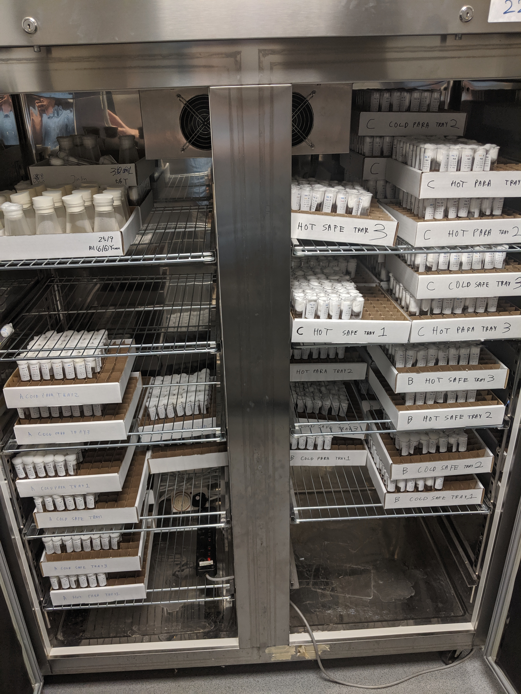
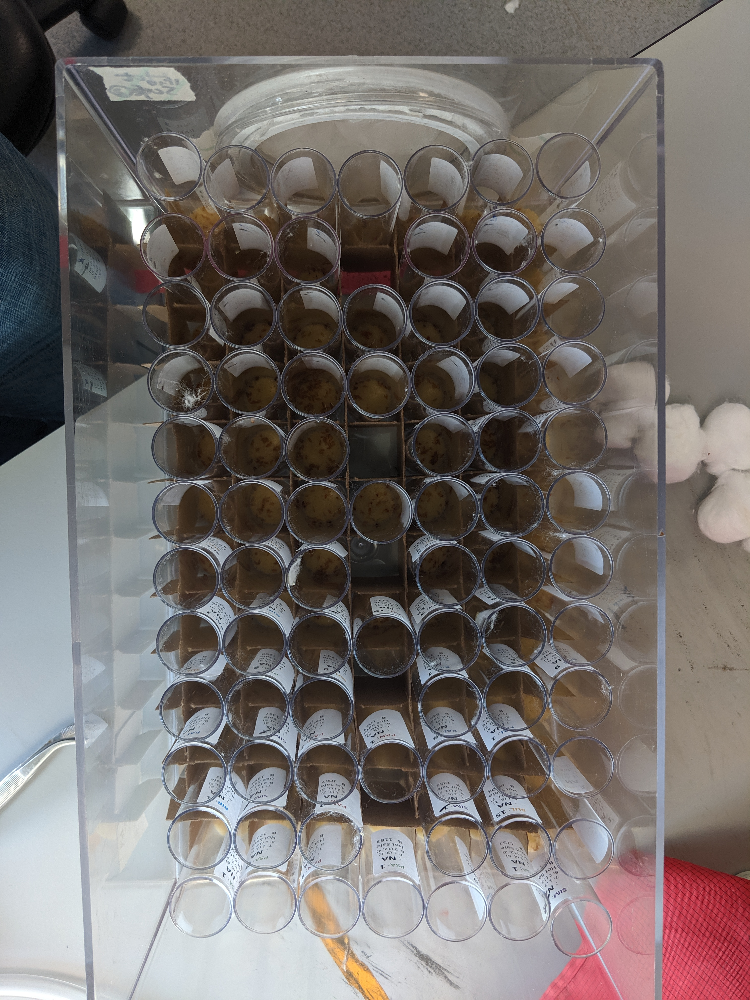

```{r setup, include=FALSE}
knitr::opts_chunk$set(echo = FALSE)
library(tidyverse)
library(knitr)
library(kableExtra)
```

## Species details

Prior to the start of the experiment, all isofemale *Drosophila* lines had been maintained in laboratory monocultures for 20-40 generations. Mass bred lines were constructed from isofemale lines and were maintained in large population cages for half a year.  Drosophila medium contains 8% corn flour, 4% yeast, 5% sugar, 1% agar, and 1.67% methyl-4-hydroxybenzoate (concentration is measured by weight/volume of water).


```{r}
data.frame( Species =   cell_spec(c('D. birchii'	, 'D. pallidifrons',	'D. pandora ', 
                                    'D. pseudoananassae', 	'D. simulans'	, 'D. sulfurigaster'		),
                                  italic = TRUE, format = 'latex'),	 
            Code =  c('BIR','PAL', 'PAN', 'PSA', 'SIM', 'SUL'),
            Species_Subgroup = c('montium', 'nasuta', 'ananassae', 
                                 'ananassae', 'melanogaster', 'nasuta'),
            Distribution = c('highland-biased','highland-biased',' lowland-biased',
                             'lowland-biased',	'only found at one lowland study site','widespread'),
            Wet_Weight = c(0.94, 2.24, 1.14, 1.01, 1.30, 2.64))%>%
  kable(col.names = c('Species', 'Code', 'Subgroup', 'Distribution', 'Wet Weight (mg)'),
        booktabs = TRUE,
        linesep = "", escape = FALSE )


```

**Table SI 1.** Details of *Drosophila* species used in laboratory experiment. Although all the species co-occur within their Australian rainforest habitat, different species are more abundant at particular elevations.    

The parasitoid wasp used is as-yet unnamed (Lue *et al.* 2021), but belongs to the *Trichopria* genus (Hymenoptera: Diapriidae). Its Smithsonian National Museum of Natural History (NMNH) reference vouchers are 
USNMENT01557121, USNMENT01557273 and USNMENT01557254 (see also http://www.boldsystems.org/index.php/Public_SearchTerms?query=DS-AUSPTOID). The parasitoid has been maintained in laboratory monocultures (as lab strain 66LD) for 2 years after collection from the field from the same community as the hosts. During culturing, *Drosophila melanogaster* was used as a host species to reduce specific selection between the parasitoid and the experimental *Drosophila* species used in the laboratory.


# Images of experimental set-up. 

{width=30%}\

**Figure S1.1** Individually plugged vials in which founder adults laid eggs and larvae competed. Vials were mainainted in an incubator at constant temperature. 


{width=30%}\

**Figure S1.2** Vertical view of unplugged vials within parasitism boxes. Empty vials containing parasitic wasps were placed in the gaps and the wasps could freely move between the tubes within each box.  


{width=30%}\


**Figure S1.3** Parasitism boxes (with lids in place) were maintained in the incubator during the parasitism period.


## Location Randomisation Procedure

Within the incubator, vials were arranged in a randomised, but structured arrangement (Fig. S1.4 and S1.5). The structure was necessary to facilitate handling. In all cases the principle that each vial had an equal change of being located at any point was maintained. Within each treatment, within each block, there was one tray for single-species assays, and two for multi-species assays. Species combinations were kept in rows, but the order of the numbers of each species used was randomised. 

Unfortunately, a mistake lead to parasitoid wasps being released into the a wrong box. Block C, Parasitoid(+) box number 2  did not receive parasitoids as planned, while Block C, Parasitoid(-) box number 1, did get parasitoids when it should not have done. This was corrected by reassigning vials to treatments, but had the result that certain combinations had one greater or fewer data point per treatment than was planned. 


```{r fig.height=8, fig.width=6}
All_TrayCoords <- read.csv('Data/Data entry Table.csv')

species <- c('BIR','PAL', 'PAN', 'PSA', 'SIM', 'SUL')
cols = c('BIR' = 'skyblue', 
         'PAL' = 'darkblue',
         'PAN' = 'red',
         'PSA'= 'darkgreen',  
         'SIM' = 'purple', 
         'SUL' = 'gold'  )

Cols = c(cols, '   '= 'white')

All_TrayCoords%>%
  filter(Treatment %in% c( 'Hot Para', 'Hot Safe'))%>%
  mutate(Set = paste(Treatment, Block))%>%
  ggplot( aes( Column  , Row, col=Sp2,fill = Sp1))+
  geom_tile(size = 1, width=.5, height=.5)+
  facet_grid(Set~Tray)+
  scale_fill_manual(values = Cols)+
  scale_colour_manual(values = Cols)+
  scale_x_discrete()+scale_y_discrete()+
  theme(axis.title = element_blank())+
  coord_fixed()-> Plot1

Plot1
```

**Figure S1.4** Randomisation of vials in trays by species combination for founding and larvae competition. Species combinations were maintained in lines to facilitate rapid handling. Within each sub-block, the order of the founder density levels was randomised. The distinction between species '1' and '2' is arbitrary. 

```{r fig.height=8, fig.width=6}

All_TrayCoords%>%
  filter(Treatment %in% c( 'Hot Para', 'Hot Safe'))%>%
  mutate(Set = paste(Treatment, Block))%>%
  ggplot( aes( Cols_Box,Rows_Box , col=Sp2,fill = Sp1))+
  geom_tile(size = 1, width=.5, height=.5)+
  facet_wrap(Set~BoxNum)+
  scale_fill_manual(values = Cols)+
  scale_colour_manual(values = Cols)+
  scale_x_discrete()+scale_y_discrete()+
  theme(axis.title = element_blank())+
  coord_fixed() -> Plot2

Plot2
```

**Figure S1.5**  Randomisation of vials into parasitoid treatment boxes. For the multi-species vials, the order of the founder density levels was randomised within each line. The distinction between species '1' and '2' is arbitrary. 


## Temperature Treatment

Our initial experimental design included a low-temperature treatment (20°C). This followed identical procedures, although some incubation times were lengthened to account for slower development times. However, too few adult flies emerged in the 20°C treatment for reasonable identification of competition parameters and we do not consider this cold-temperature treatment further.


# References

Lue, C.-H., Buffington, M. L., Scheffer, S., Lewis, M., Elliott, T. A., Lindsey, A. R. I., … Hrcek, J. (2021). DROP: Molecular voucher database for identification of Drosophila parasitoids. BioRxiv. https://doi.org/10.1101/2021.02.09.430471